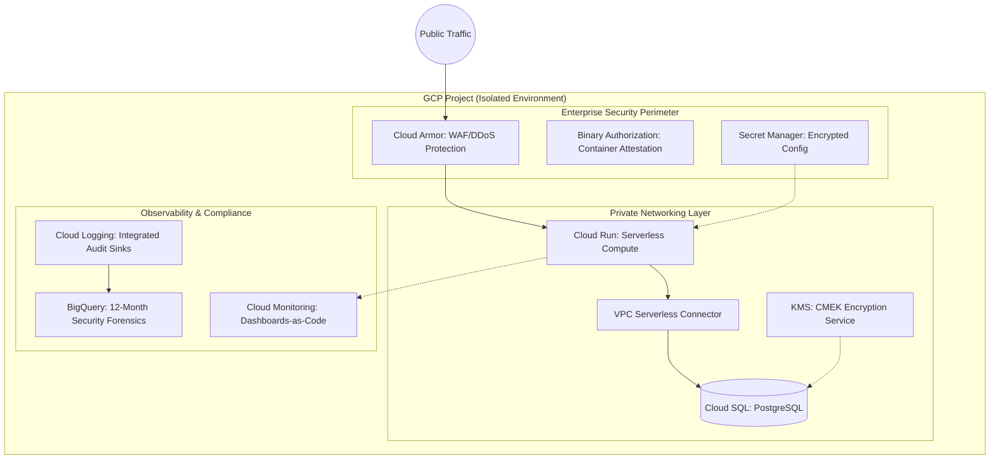

# Keystone

**Enterprise-Grade Infrastructure-as-Code (IaC) for Mission-Critical Applications.**

Keystone is a battle-hardened infrastructure foundation designed for organizations that require high-availability, zero-trust security, and operational excellence on Google Cloud Platform. It moves beyond simple cloud deployments into **automated, self-healing, and cost-aware operations**.

---

## Executive Summary

Keystone solves the "last-mile" problems of cloud infrastructure. While most IaC projects stop at resource provisioning, Keystone implements the internal controls, security safeguards, and observability patterns required by enterprise compliance (SOC2/ISO27001) and high-scale production environments.

### Core Value Pillars

*   **Security by Default:** Zero-trust architecture with identity federation, CMEK encryption, and automated WAF policies.
*   **Operational Maturity:** Custom Go-based preflight validation and failure-first runbooks reduce MTTR (Mean Time To Recovery).
*   **Economic Engineering:** Integrated cost-tracking (Infracost) treats budget as a primary engineering constraint, not an afterthought.
*   **Verified Reliability:** Programmatic infrastructure testing via `terraform test` prevents configuration drift and security regressions.

---

## What Makes Keystone Different?

**Most portfolios show you can deploy. Keystone shows you can *operate* at scale.**

| Feature | Keystone Implementation | Business Value |
|:---|:---|:---|
| **Pre-Deployment Audit** | **Go Preflight Engineer**: A custom binary that validates GCP environment state (quotas, APIs, credentials) before Terraform execution. | Prevents pipeline failures and deployment bottlenecks. |
| **Secure Supply Chain** | **Multi-Stage Security**: Integrated TruffleHog (secrets), Trivy (vulnerabilities), and SBOM generation for every artifact. | Minimizes the attack surface and ensures compliance. |
| **Cost Transparency** | **Shift-Left Economics**: Automated "Cost Deltas" on every Pull Request via Infracost. | Prevents "Cloud Bill Shocker" and optimizes OPEX. |
| **Zero-Trust Identity** | **Keyless Authentication**: Workload Identity Federation (WIF) eliminates long-lived service account keys. | Removes the #1 cause of cloud data breaches (leaked keys). |
| **Failure Playbooks** | **Antifragile Docs**: Deep failure-mode analysis and recovery runbooks for 3 AM incidents. | Reduces downtime and improves engineer confidence. |

---

## Detailed System Architecture

Keystone leverages a modular, decoupled architecture to ensure scalability and maintainability.

---

## The Technology Stack

Keystone utilizes industry-leading tools selected for their stability, security, and developer experience.

*   **Infrastructure:** Terraform (HCL), Google Cloud Platform (GCP).
*   **Compute:** Google Cloud Run (Serverless Containers).
*   **Database:** Cloud SQL (PostgreSQL) with High Availability (HA) and CMEK.
*   **Storage:** Google Cloud Storage (GCS) with lifecycle policies.
*   **Security:** Cloud Armor, Binary Authorization, KMS, Secret Manager, Workload Identity.
*   **Observability:** Cloud Monitoring, Cloud Logging, BigQuery (Audit).
*   **Tooling:** Go (Preflight utility), Make (Automation), Shell (Tooling).
*   **CI/CD:** GitHub Actions, Infracost, Trivy, TruffleHog, Gitleaks.

---

## Operational Excellence (Day-2)

Infrastructure is only as good as its management. Keystone provides built-in targets for common operational tasks.

| Operational Task | Command | Strategic Documentation |
|:---|:---|:---|
| **Identity Management** | `make setup-wif` | [Zero-Trust Identity Strategy](docs/security.md) |
| **Security Auditing** | `make security-audit` | [Compliance & Detection](docs/security.md) |
| **Secret Rotation** | `make rotate-secrets` | [Credentials Lifecycle](docs/security.md) |
| **Data Recovery** | `make restore ID=...` | [Incident Response Playbooks](docs/how-things-break.md) |
| **Cost Estimation** | `make plan ENV=prod` | [Economic Engineering](docs/STANDOUT.md) |

---

## Strategic Design Decisions (Non-Goals)

Keystone follows the principle of **Pragmatic Engineering**. We intentionally avoid complexity that doesn't provide immediate business ROI.

*   **No Kubernetes:** For singular microservices, GKE adds 40% operational overhead with no performance gain over Cloud Run.
*   **No Multi-Cloud:** "Cloud Agnostic" layers often lead to the "Lowest Common Denominator" problem, sacrificing deep provider-specific security features.
*   **No Zero-Downtime Migrations:** While possible, maintenance windows are significantly more cost-effective for 99.9% of growth-stage applications.
*   **Single-Region Optimization:** Multi-region adds 3x cost; Keystone prioritizes Regional HA with secondary-region backup strategies ($425/mo prod target).

---

## Documentation Index

*   [**Architecture Deep Dive**](docs/architecture.md) - System design and data flow.
*   [**Deployment Guide**](docs/deployment.md) - End-to-end setup and automation.
*   [**Security & Compliance**](docs/security.md) - Encryption, IAM, and network strategy.
*   [**How Things Break**](docs/how-things-break.md) - Failure modes and recovery runbooks.
*   [**Cost Analysis**](docs/STANDOUT.md) - Economic justification and ROI analysis.

---

**Engineered by Keystone Infrastructure.** Built for growth, secured for the enterprise.
