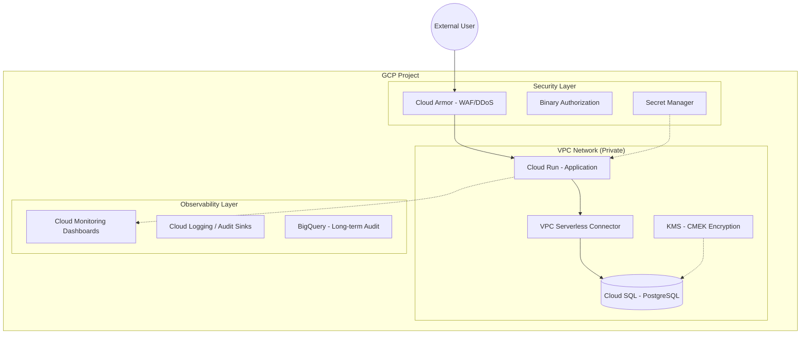

# Keystone

**The Enterprise-Grade Infrastructure Foundation for Configra.**

Keystone is a battle-hardened Infrastructure-as-Code (IaC) repository designed for high-availability, zero-trust security, and observability. It demonstrates how to move beyond simple deployments into **production-grade operations**.

[](https://github.com/yourusername/keystone/actions/workflows/security-scan.yml)
[](https://github.com/yourusername/keystone/actions/workflows/test.yml)
[](https://opensource.org/licenses/MIT)

---

## What Makes Keystone Different?

**Most portfolios show you can deploy. Keystone shows you can *operate*.**

*   **Go Preflight Engineer:** A custom binary that performs deep inspection of your GCP environment *before* Terraform runs. It catches quota issues, API gaps, and credential lapses before they become outages.
*   **Zero-Trust Security:** Includes Cloud Armor (WAF/DDoS), Binary Authorization, egress filtering, and Customer-Managed Encryption Keys (CMEK) via KMS.
*   **Verified Infrastructure:** Not just "valid" HCL—we use `terraform test` to programmatically verify security invariants (like ensuring no public SSH access) before resources are provisioned.
*   **Economic Awareness:** Integrated `Infracost` in CI/CD to provide automated cost transparency on every PR, treating budget as a first-class engineering constraint.
*   **Failure-First Documentation:** While others document how it works, we document how it **breaks** and how to fix it via professional runbooks.

---

## System Architecture



---

## Features & Capabilities

### Security & Compliance
- **Identity:** Workload Identity Federation for GitHub Actions (Zero Service Account Keys).
- **Encryption:** All data at rest in Cloud SQL/GCS is encrypted using **KMS** with 90-day automated rotation.
- **WAF:** **Cloud Armor** with OWASP ModSecurity rules against SQLi and XSS.
- **Network:** Private Google Access, egress firewall filtering, and VPC service connectors.
- **Audit:** Automated BigQuery log sinks for long-term security forensics.

### Observability
- **Dashboards-as-Code:** Automated provisioning of Cloud Monitoring dashboards (latency, error rates, DB backends).
- **Proactive Alerting:** Pre-configured SLIs for 5xx errors and p95 latency thresholds.
- **Health Validation:** Custom Go-based health checkers and automated uptime monitors.

### Advanced IaC
- **Modular Design:** Decoupled modules for `network`, `compute`, `database`, `security`, and `monitoring`.
- **Environment Isolation:** Strict separation between `dev` and `prod` utilizing remote state locking.
- **CI/CD Hygiene:** Multi-stage pipelines including `trufflehog` secrets detection and `trivy` vulnerability scanning.

---

## Repository Structure

```text
keystone/
├── terraform/
│   ├── modules/           # Reusable Infrastructure Components
│   │   ├── security/      # KMS, Audit Sinks, IAM
│   │   ├── network/       # VPC, Cloud Armor, VPC Connectors
│   │   ├── compute/       # Cloud Run, Binary Auth
│   │   └── monitoring/    # Dashboards, Alerting
│   └── environments/      # Environment-specific Overlays (Dev/Prod)
├── tools/
│   └── preflight/         # Go-based Environment Validator
├── scripts/
│   ├── bootstrap.sh       # Day-Zero project setup automation
│   ├── rotate-secrets.sh  # Automated secret rotation utility
│   └── backup.sh          # Encrypted backup automation
├── .github/workflows/     # CI/CD (Cost, Security, Testing, Deployment)
└── docs/                  # Professional Operations Manuals
```

---

## The 5-Minute Setup

### 1. Prerequisites
- [Google Cloud SDK](https://cloud.google.com/sdk/docs/install)
- [Terraform >= 1.5](https://developer.hashicorp.com/terraform/downloads)

### 2. High-Speed Bootstrap
```bash
# Initialize project, enable APIs, and create state buckets
make bootstrap ENV=dev
```

### 3. Verify & Plan
```bash
# Run the Go preflight checker to ensure environment readiness
make preflight ENV=dev

# Run automated infrastructure tests
make test-infra

# Generate cost-aware infrastructure plan
make plan ENV=dev
```

### 4. Deploy
```bash
make apply ENV=dev
```

---

## Day-2 Operations

| Task | Command | Document |
|:---|:---|:---|
| **Secret Rotation** | `make rotate-secrets` | [`docs/security.md`](docs/security.md) |
| **Identity Setup** | `make setup-wif` | [`docs/deployment.md`](docs/deployment.md) |
| **System Backup** | `make backup` | [`docs/deployment.md`](docs/deployment.md) |
| **Recovery** | `make restore BACKUP_ID=...` | [`docs/failure-scenarios.md`](docs/failure-scenarios.md) |
| **Security Audit** | `make security-audit` | [`docs/security-incident-response.md`](docs/security-incident-response.md) |

---

## Explicit Non-Goals

Keystone is intentionally focused to ensure simplicity and cost-effectiveness:
- **No Kubernetes:** Overkill for this application; Cloud Run provides superior serverless management.
- **No Multi-Cloud:** Focuses on deepening GCP expertise rather than shallow multi-cloud support.
- **No Zero-Downtime DB Migrations:** Managed via maintenance windows to reduce complexity.
- **Single-Region:** Optimized for cost ($425/mo prod) over redundant multi-region availability.

---

## Documentation Index

- [Architecture](docs/architecture.md) - Deep dive into system design.
- [Deployment](docs/deployment.md) - End-to-end setup and migration guide.
- [Security](docs/security.md) - Compliance, encryption, and network strategy.
- [How Things Break](docs/how-things-break.md) - A "failure-first" look at the system.
- [Incident Response](docs/security-incident-response.md) - Security breach runbooks.

---

**Built by Keystone Engineering.** Licensed under MIT.
