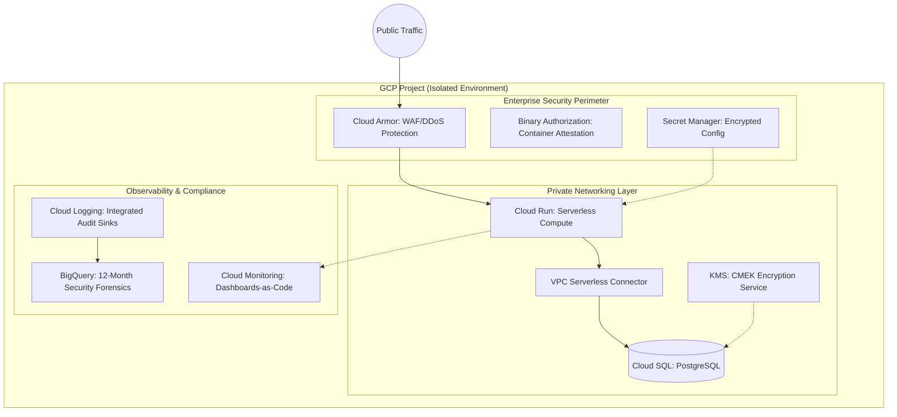

# Keystone

**Enterprise-Grade Infrastructure-as-Code (IaC) for Mission-Critical Applications.**

Keystone is a battle-hardened infrastructure foundation designed for organizations that require high-availability, zero-trust security, and operational excellence on Google Cloud Platform. It moves beyond simple cloud deployments into **automated, self-healing, and cost-aware operations**.

> 🔗 **[Live Portfolio Dashboard →](https://clyvecute.github.io/keystone/)** — Real-time pipeline status, security posture, and architecture overview.

---

## Executive Summary

Keystone solves the "last-mile" problems of cloud infrastructure. While most IaC projects stop at resource provisioning, Keystone implements the internal controls, security safeguards, and observability patterns required by enterprise compliance (SOC2/ISO27001) and high-scale production environments.

### Core Value Pillars

*   **Security by Default:** Zero-trust architecture with identity federation, CMEK encryption, and automated WAF policies.
*   **Operational Maturity:** Custom Go-based preflight validation and failure-first runbooks reduce MTTR (Mean Time To Recovery).
*   **Economic Engineering:** Integrated cost-tracking (Infracost) treats budget as a primary engineering constraint, not an afterthought.
*   **Verified Reliability:** Programmatic infrastructure testing via `terraform test` prevents configuration drift and security regressions.

---

## What Makes Keystone Different?

**Most portfolios show you can deploy. Keystone shows you can *operate* at scale.**

| Feature | Keystone Implementation | Business Value |
|:---|:---|:---|
| **Pre-Deployment Audit** | **Go Preflight Engineer**: Custom Go binary validating GCP quotas, APIs, IAM, and state buckets before Terraform runs. | Prevents pipeline failures and deployment bottlenecks. |
| **Multi-Layer Security** | **Automated Security Suite**: 4 parallel workflows running `tfsec`, `Checkov` (IaC), `Trivy` (CVEs), `TruffleHog` & `Gitleaks` (Secrets), and `OSSF Scorecard`. | Minimizes attack surface, prevents key leaks, and ensures SOC2 compliance. |
| **Shift-Left FinOps** | **Cost Transparency**: Automated PR cost-delta analysis via `Infracost` treats budget as a primary engineering constraint. | Prevents cloud bill shockers and optimizes OPEX. |
| **Zero-Trust Identity** | **Keyless Authentication**: Workload Identity Federation (WIF) with OIDC eliminates long-lived service account keys. | Removes the #1 cause of cloud breaches (leaked access keys). |
| **Operational Dashboards** | **Live Status Site**: Real-time status dashboard hosted on GitHub Pages powered by the GitHub REST API. | Full operational visibility for engineering teams and stakeholders. |
| **Failure Playbooks** | **Antifragile Docs**: Deep failure-mode analysis and incident recovery runbooks for 3 AM outages. | Reduces MTTR and increases engineering confidence. |

---

## Detailed System Architecture

Keystone leverages a modular, decoupled architecture to ensure scalability and maintainability.

```mermaid
graph TD
    subgraph "GCP Project (Isolated Environment)"
        subgraph "Private Networking Layer"
            CR[Cloud Run: Serverless Compute]
            VPC_CONN[VPC Serverless Connector]
            DB[(Cloud SQL: PostgreSQL)]
            KMS[KMS: CMEK Encryption Service]
        end
        
        subgraph "Enterprise Security Perimeter"
            CA[Cloud Armor: WAF/DDoS Protection]
            BA[Binary Authorization: Container Attestation]
            SM[Secret Manager: Encrypted Config]
        end
        
        subgraph "Observability & Compliance"
            MON[Cloud Monitoring: Dashboards-as-Code]
            LOG[Cloud Logging: Integrated Audit Sinks]
            BQ[BigQuery: 12-Month Security Forensics]
        end
    end
    
    User((Public Traffic)) --> CA
    CA --> CR
    CR --> VPC_CONN
    VPC_CONN --> DB
    SM -.-> CR
    KMS -.-> DB
    CR -.-> MON
    LOG --> BQ
```

---

## The Technology Stack

Keystone utilizes industry-leading tools selected for their stability, security, and developer experience.

*   **Infrastructure:** Terraform (HCL), Google Cloud Platform (GCP).
*   **Compute:** Google Cloud Run (Serverless Containers).
*   **Database:** Cloud SQL (PostgreSQL) with High Availability (HA) and CMEK.
*   **Storage:** Google Cloud Storage (GCS) with lifecycle policies.
*   **Security:** Cloud Armor, Binary Authorization, KMS, Secret Manager, Workload Identity.
*   **Observability:** Cloud Monitoring, Cloud Logging, BigQuery (Audit).
*   **Tooling:** Go (Preflight utility), Make (Automation), Shell (Tooling).
*   **CI/CD:** GitHub Actions, Infracost, Trivy, TruffleHog, Gitleaks.

---

## Operational Excellence (Day-2)

Infrastructure is only as good as its management. Keystone provides built-in targets for common operational tasks.

| Operational Task | Command | Strategic Documentation |
|:---|:---|:---|
| **Identity Management** | `make setup-wif` | [Zero-Trust Identity Strategy](docs/security.md) |
| **Security Auditing** | `make security-audit` | [Compliance & Detection](docs/security.md) |
| **Secret Rotation** | `make rotate-secrets` | [Credentials Lifecycle](docs/security.md) |
| **Data Recovery** | `make restore ID=...` | [Incident Response Playbooks](docs/how-things-break.md) |
| **Cost Estimation** | `make plan ENV=prod` | [Economic Engineering](docs/STANDOUT.md) |

---

## Strategic Design Decisions (Non-Goals)

Keystone follows the principle of **Pragmatic Engineering**. We intentionally avoid complexity that doesn't provide immediate business ROI.

*   **No Kubernetes:** For singular microservices, GKE adds 40% operational overhead with no performance gain over Cloud Run.
*   **No Multi-Cloud:** "Cloud Agnostic" layers often lead to the "Lowest Common Denominator" problem, sacrificing deep provider-specific security features.
*   **No Zero-Downtime Migrations:** While possible, maintenance windows are significantly more cost-effective for 99.9% of growth-stage applications.
*   **Single-Region Optimization:** Multi-region adds 3x cost; Keystone prioritizes Regional HA with secondary-region backup strategies ($425/mo prod target).

---

## Scaling Roadmap

Keystone's production environment already configures Cloud Run to scale from one warm instance to 100, with 80 concurrent requests per instance, and uses a regional HA Cloud SQL instance. These are capacity controls, not a guarantee of a particular requests-per-day target: throughput depends on request duration, CPU and memory use, database connection behavior, quotas, and workload shape. Scale in measured steps and validate each change with representative load tests and the existing latency, error-rate, saturation, and cost monitoring.

### 1. Establish a capacity baseline

Measure requests per second and latency percentiles, Cloud Run instance/concurrency utilization, Cloud SQL CPU and connections, and cost at expected peak traffic. Set explicit SLOs and alert thresholds, then load-test burst and sustained traffic. Tune Cloud Run concurrency and instance bounds to the application's measured behavior; increasing concurrency can worsen latency or exhaust database connections if the application or database pool is not sized for it. Confirm project quotas and regional capacity before raising maximum instances.

### 2. Add an edge entry point when needed

For global ingress, centralized TLS, Cloud Armor policy, and cacheable static or public responses, add a global external Application Load Balancer in front of Cloud Run. Cloud CDN only helps cache eligible responses; authenticated or personalized API responses should not be cached without a deliberate cache-key and privacy design. The current Terraform compute module deploys Cloud Run directly and does not provision this load balancer or CDN, so treat this as a separate infrastructure milestone and verify the chosen serverless NEG/backend configuration before rollout.

### 3. Expand compute geographically only for a clear availability or latency need

Deploy Cloud Run in a second region and route traffic through a global load balancer when measured user latency, regional resilience objectives, or recovery requirements justify the added operational and data-management complexity. Define health checks, rollout/failover behavior, secrets and networking per region, and database failover/replication strategy first. The current production configuration is single-region; multiple Cloud Run regions alone do not make a single-region database highly available across regions.

### 4. Protect the database and move work off the request path

First right-size Cloud SQL, tune indexes and connection pooling, and monitor connection count and query latency. Add read replicas only for suitable read-heavy workloads after checking replication lag and application consistency needs; replicas do not increase write capacity and require application routing changes. A Redis/ Memorystore cache is a later option for data with clear freshness and invalidation rules. Move slow, retryable work such as report generation or notifications to Pub/Sub or Cloud Tasks workers, with idempotency, bounded retries, and dead-letter handling. Consider Spanner only after the workload's write scale and multi-region consistency/availability needs exceed Cloud SQL's practical limits and a migration analysis supports the cost and data-model change.

### 5. Scale platform operations with environment boundaries

Keep separate projects and isolated Terraform state per environment. Add regional or tenant-specific state/configuration only when ownership and release processes require it; Terraform workspaces or Terragrunt do not by themselves provide isolation. Document promotion, rollback, disaster recovery, and quota ownership as part of each new environment.

### 6. Keep preflight fast without hiding failures

The Go preflight currently executes checks sequentially, and several checks invoke `gcloud` or Terraform subprocesses. If preflight duration becomes a CI bottleneck, parallelize independent checks with a bounded worker pool, per-check timeouts, and deterministic result ordering. Preserve required-versus-optional status and report each failure; measure before and after rather than assuming a sub-second target.

Use this sequence as a decision path, not a default deployment checklist: collect a baseline, fix the measured bottleneck, and review the resulting reliability and cost before moving to the next stage.

---

## Documentation Index

*   [**Architecture Deep Dive**](docs/architecture.md) - System design and data flow.
*   [**Deployment Guide**](docs/deployment.md) - End-to-end setup and automation.
*   [**Security & Compliance**](docs/security.md) - Encryption, IAM, and network strategy.
*   [**How Things Break**](docs/how-things-break.md) - Failure modes and recovery runbooks.
*   [**Cost Analysis**](docs/STANDOUT.md) - Economic justification and ROI analysis.

---

**Engineered by Keystone Infrastructure.** Built for growth, secured for the enterprise.
