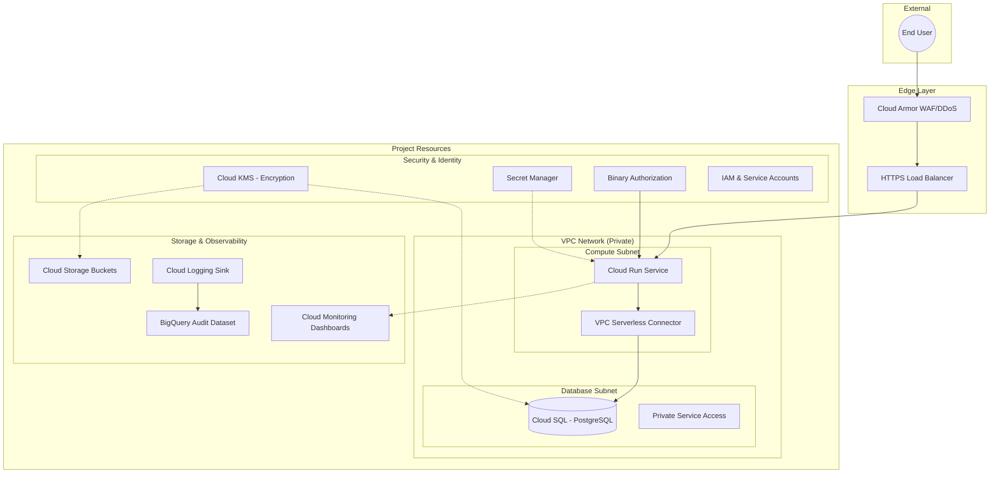

# Architecture

## Overview

Keystone is a production-ready infrastructure layer designed to support the Configra application. It demonstrates cloud-native best practices, zero-trust security architecture, and operational excellence through Infrastructure-as-Code (IaC).

## System Design (Enterprise Architecture)

## Core Components

### 1. Compute Layer (Cloud Run & Binary Auth)

**Purpose**: High-scale, zero-maintenance container platform.

**Enterprise Features**:
- **Binary Authorization**: Only attested and signed images are allowed to reach production.
- **VPC Connector**: All egress traffic is routed through the VPC, allowing private IP communication with the database.
- **Dedicated Service Identity**: The application runs under a specific service account with minimum permissions (e.g., `roles/secretmanager.secretAccessor`).

### 2. Networking Layer (Secure VPC)

**Zero-Trust Networking**:
- **Private-Only Access**: Public IP access to Cloud SQL is disabled. Communication happens via Internal IP through the **VPC Serverless Connector**.
- **Egress Firewall Filtering**: A "Deny-All" default egress rule prevents unauthorized outbound traffic (preventing data exfiltration). Explicit rules allow access only to required Google APIs.
- **Private Google Access**: Subnets are configured to access GCP services without traversing the public internet.

### 3. Security Layer (Defense-in-Depth)

**Key Controls**:
- **WAF & DDoS (Cloud Armor)**: Pre-configured rules to block XSS, SQLi, and stabilize traffic through rate-limiting.
- **Encryption at Rest (CMEK)**: Sensitive data in Cloud SQL and Cloud Storage is encrypted using **Cloud KMS** (Customer-Managed Encryption Keys).
- **Audit Compliance**: A specialized logging sink captures high-value security events (IAM changes, secret access) and streams them to **BigQuery** for long-term retention.

### 4. Database Layer (Hardened Cloud SQL)

**Configuration**:
- **High Availability**: Regional configuration with automatic failover (Prod).
- **Audit Logs**: `pgaudit` and database flags enabled for comprehensive SQL-level auditing.
- **Managed Backups**: Automated daily backups with 30-day retention and cross-region protection.

### 5. Monitoring Layer (Dashboards-as-Code)

**Observability Stack**:
- **Managed Dashboards**: All dashboards (Latency p95, Error Rates, Request Count) are defined in Terraform.
- **Intelligent Alerting**: Alert policies monitor for SLI breaches (e.g., error rate > 1%) with notification channel integration.

## Data Flow

### Request Flow
1. **User Request**: HTTPS request hits the Global Load Balancer.
2. **WAF Validation**: **Cloud Armor** inspects headers/payload for attacks.
3. **Admission Control**: **Binary Authorization** verifies the container revision is trusted.
4. **Execution**: Cloud Run processes the logic.
5. **Private Query**: Cloud Run reaches the database via the **VPC Connector** on a private IP string.
6. **Response**: Validated response returns to the user.

### Security Audit Flow
1. **Event Capture**: Any IAM change or Secret access is logged by Cloud Logging.
2. **Sink Filtering**: The `audit-sink` filters for high-severity/security events.
3. **Long-term Storage**: Events are streamed to BigQuery for forensic analysis.

## Cost Optimization

Keystone uses a dual-environment strategy:
- **Dev**: Scales to Zero (Free tier baseline), Zonal DB ($).
- **Prod**: Minimum 1 Warm instance, Regional HA DB ($$$).
- **Infracost Integration**: Automated cost delta reporting on every infrastructure PR.

## Technology Choices

| Choice | Rational |
|:---|:---|
| **Terraform** | Industry standard for reproducibility and drift detection. |
| **Cloud Run** | Superior to K8s for speed-to-market and built-in load balancing. |
| **KMS** | Critical for compliance requirements regarding key control. |
| **Mermaid.js** | Living documentation—diagrams stay in sync with the codebase. |

---

*This architecture document is versioned alongside the infrastructure code. For implementation details, see `/terraform/modules`.*
